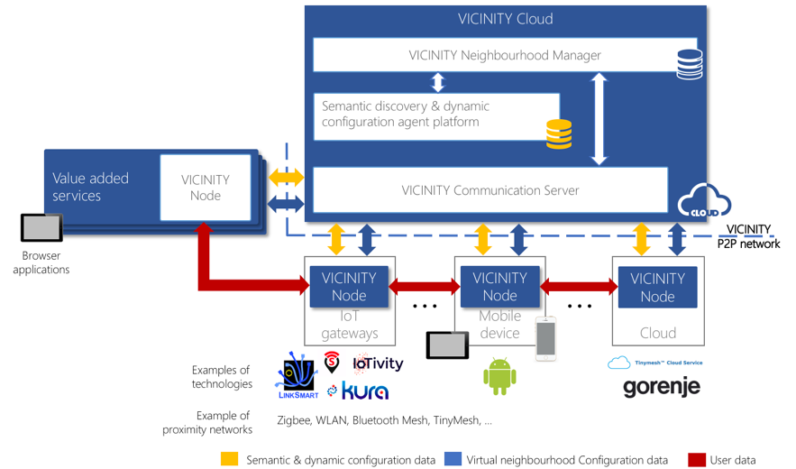

=============================
VICINITY Overall architecture
=============================

The objective of the VICINITY architecture [#f1]_  is to facilitate interoperability between different IoT infrastructures’ devices and to software-enable value-added services through a peer-to-peer (P2P) network of VICINITY Nodes. Each VICINITY Node provides access to IoT infrastructure and/or value-added service. Once the IoT infrastructure is integrated into the VICINITY neighbourhood through the VICINITY Node, devices connected to the infrastructure become accessible through the VICINITY Neighbourhood Manager in the VICINITY Cloud. In VICINITY Neighbourhood Manager IoT infrastructure owner can define sharing access rules of devices and service (i.e. has direct control over his or her devices). Based on these rules he or she creates social network of devices and service called “virtual neighbourhood”.

The VICINITY Nodes create a controlled VICINITY Peer-to-peer (P2P) Network based on these rules defined by VICINITY Neighbourhood Manager (Figure 1 – yellow and blue arrows) in VICINITY Cloud. In VICINITY P2P Network, VICINITY Nodes communicate user data directly between each other (red arrows in the following figure). Moreover, the VICINITY P2P Network support VICINITY Node with security services (such as end-to-end encryption, data integrity, etc.) to ensure security and privacy of exchanged user data.

.. class:: center
(Figure 1)

The VICINITY provides semantic interoperability features to facilitate exchange of user data between IoT devices and value-added services to overcome technology differences between each connected IoT ecosystem. Thus, communication with each device or service via VICINITY P2P Network is standardised regardless of the technology the device or service is connected to a VICINITY Node. This semantic interoperability approach is based on the work being done by the Web of Things (WoT) WG [#f2]_ , where a proposal for describing, exposing and consuming web things by leveraging Semantic Web technologies is in development. Such web things are things that can be accessed through the Web, either physically or abstract.

One of the pillars of the W3C WoT is the Thing Description (TD), which aims to be a standard frame to support the description of web things semantically to make them interoperable. Thus, TDs are expected to cover the following aspects:

* Semantic meta-data, so to explicitly specify the semantics of a web thing;
* Thing’s interaction resources: property, action and event;
* Security including concrete prerequisites to access things are stated;
* Communications, i.e., what kind of protocols and data exchange formats are supported, and which endpoints are exposed to give access to the existing interaction resources of a web thing.

--------------
VICINITY Cloud
--------------

The VICINITY Cloud enables IoT infrastructure operators and Service providers to configure a virtual neighbourhood of connected devices and value-added services including the setup of sharing access rules between them through the user-friendly interface of VICINITY Neighbourhood Manager. Configuration of the virtual neighbourhood and sharing access rules are used by VICINITY Communication Server to setup communication channels between each VICINITY Node to control exchange of user data. IoT infrastructure operators and Service providers can search for devices and services in virtual neighbourhood based on semantic description of device properties, actions, events and service products & required inputs stored in semantic repository. Moreover, IoT operators, System integrators and Services providers can register the VICINITY Nodes (registration of the application API) to communication in peer-to-peer.

-------------
VICINITY Node
-------------

A VICINITY Node is the set of software components which maintains the user data exchange between peers in the VICINITY P2P network based on configuration of the virtual neighbourhood and sharing rules received from VICINITY Communication Server. For that purpose, VICINITY Node consists of the following 3 main components:

* VICINITY Gateway API and Communication Node;
* VICINITY Agent;
* VICINITY Adapter.

.. image:: images/vcnt_node.png

.. note::
  The *VICINITY Gateway API and Communication Node* service provides the following set of JSON HTTP REST  services in the VICINITY common format and data model:

  * Registry service to register devices and value-added services using their simple semantic description as JSON document in VICINITY;
  * Search service in virtual neighbourhood of connected IoT infrastructures and value-added services;
  * Services to read/write properties, performing actions and process events from shared devices device/service from connected IoT infrastructure or value-added service;
  * Expose properties, actions and events of device/service to VICINITY through simple REST API;
  * Authentication services for the IoT infrastructure (authentication of the application) and devices and value-added services;
  * Status check service (in development).

.. note::
  The *VICINITY Adapter* is a component provided by IoT infrastructure owner or respective system integrator. The VICINITY Adapter provides simple API, which has to be implemented for every adopted infrastructure. The core responsibilities of the Adapter API are:

  * to provide the description of IoT objects (devices, services) of infrastructure in common VICINITY format, which enables VICINITY to create internal models of used IoT objects in uniform way;
  * to provide access to properties, actions and events of devices provided by infrastructure.

The purpose of the VICINITY Adapter is to simplify the adoption of IoT infrastructure in as simple way as possible. The Adapter is used just to discover IoT objects in infrastructure and to communicate with IoT objects. Once the IoT infrastructure owner/system integrator provides the Adapter component implementing simple prescribed API, the IoT infrastructure can be easily adopted. The full VICINITY functionality is then managed by VICINITY Agent component.

The *VICINITY Agent* is the wrapper for the VICINITY Adapter. The VICINITY Adapter provides the full VICINITY specific functionality, as managing communication via P2P network, semantic discovery of IoT objects, semantic search of IoT objects, communication with IoT objects within the infrastructure, where each VICINITY specific interaction with IoT objects is translated in the VICINITY Adapter calls.
Simply speaking, the Adapter handles only very basic communication with IoT infrastructure by implementing simple API. Agent manages full VICINITY interactions with IoT infrastructure by translating this interaction into the Adapter API services.

---------------------------------------------
How to connect IoT infrastructure to VICINITY
---------------------------------------------

The VICINITY support following VICINITY Node deployment scenarios:

*	VICINITY Node local IoT gateway deployment – IoT infrastructure A
  VICINITY and IoT infrastructure are integrated in location of deployment of infrastructure. In this scenario the VICINITY Gateway API, VICINITY Agent and Adapter are deployed directly in IoT infrastructure. For example, if IoT infrastructure is deployed in household all these components can be deployed directly on the household. Moreover, if you IoT infrastructure platform enables run the Java 8 applications the API, Agent and Adapter can run in the same environment. In this scenario VICINITY Node is used only by one organisation (household, company, etc.) - *multi tenant mode*.
*	VICINITY Node cloud deployment – IoT infrastructure B
  VICINITY and IoT infrastructure are integrated on the level of cloud services. For example, if your IoT infrastructure provides cloud service its users, it might be beneficial to deploy and integrate VICINITY Node with Cloud services rather with IoT Gateway. In this case, VICINITY Node will be used by multiple organisation (households, companies, etc.) - used in *multi tenant mode*.

.. image :: images/vcnt_connect_infra.png

-----------------------------------------------
How to integrate IoT infrastructure in VICINITY
-----------------------------------------------

The integration of IoT infrastructure in VICINITY includes following steps which needs to be performed by system integrator:

#. Installation of VICINITY Gateway API

#. Installation of VICINITY Agent

#. Registration of devices

#. Testing of devices accessibility

.. [#f1] For detail description of the VICINITY architecture see: http://vicinity2020.eu/vicinity/content/d16-architectural-design-10
.. [#f2] https://www.w3.org/WoT/IG/
.. [#f3] VICINITY Gateway API is described using Open API standard and due implementation stage of the VICINITY project it is subject of change, for conceptual understanding of the API see: https://app.swaggerhub.com/apis/intersoft.sk/vicinity-adapter/1.0.0
