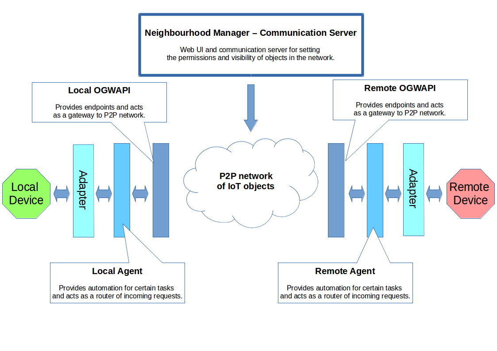
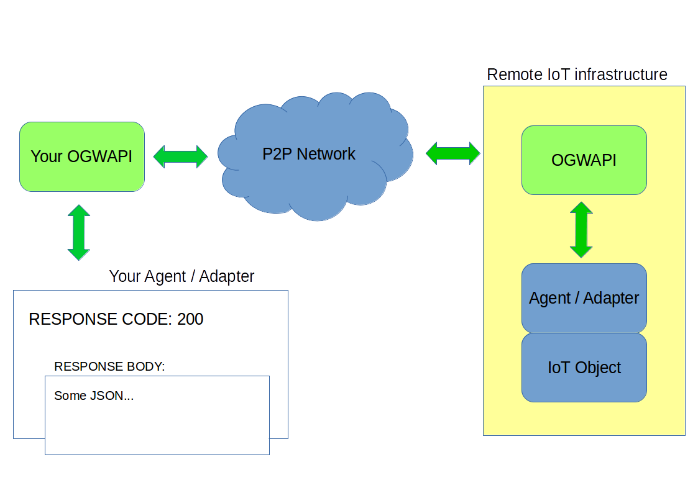
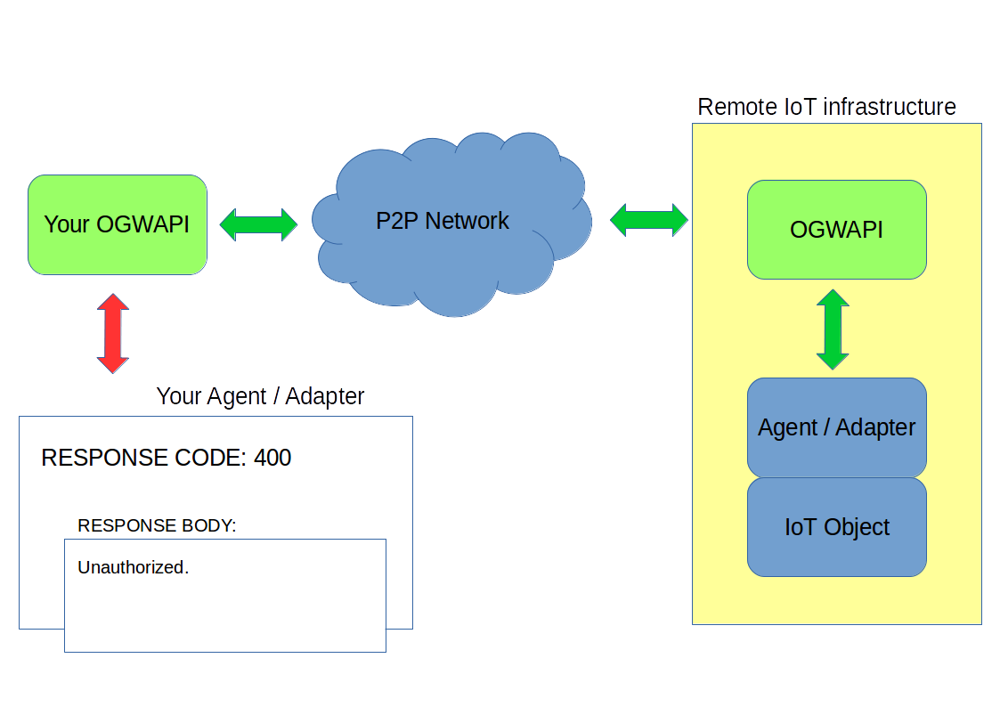
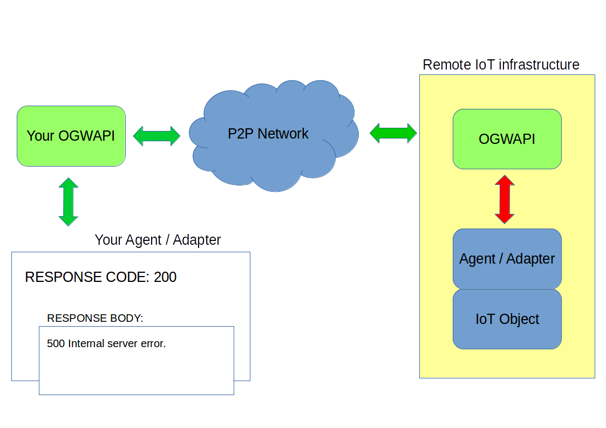

VICINITY Open Gateway API
*************************

Introduction
============

This documentation is intended to explain how to install, configure and
utilize the Open Gateway API (OGWAPI) in order to access remote IoT
objects. It also describes what steps that need to be done in order to
integrate a new IoT object into the system, so it can be accessed by
other objects on the network.

First chapter discuss a general overview of Open Gateway API
functionality and its place among other components of the system.

Second chapter goes through installation and configuration procedures.
It also lists and describes configuration parameters of the software.

Third chapter serves as a tutorial on how to utilize some of the
functionality the OGWAPI provides, namely the set of endpoints that are
used by the local objects in order to exchange data with remote objects.
It then describes all the endpoints of the OGWAPI.

Fourth chapter discuss integration of the objects into the network. In
other words, it takes reader through the requirements that the
implemented adapter has to meet in order to allow other objects on the
network to access it.

The last chapter goes through frequently asked questions.

1 Open Gateway API overview
===========================

Open Gateway API, or further in this documentation OGWAPI, is a data
gateway interconnecting two or more IoT ecosystems, that are behind a
NAT or not included in public IP addressing scheme. OGWAPI in those
infrastructures acts alike a chat client, that is able to exchange
messages with other OGWAPIs in a P2P network. Embedded in these chat
messages are HTTP/HTTPS requests, that are to be transferred across the
network. At the other side, they are decoded by the other OGWAPI and
turned back to HTTP/HTTPS requests, distributed in the remote private
IoT ecosystem.

The OGWAPI provides multiple HTTPS interfaces for your local
infrastructure, that should cover all (or at least most) of the
functionalities a common IoT ecosystem provides:

-  retrieving and setting of a property (e.g. brightness),
-  starting or stopping of an action ( e.g. raising curtains),
-  transmitting an event (e.g. door were opened).

However, the OGWAPI is just one part in the whole system, that consists
of two more layers and one web portal, that makes this exchange as much
automated and secure as possible.

The layer that is closest to the OGWAPI is what we call an Agent. Agent
acts like a router, distributing the incoming requests among the local
nodes. Moreover it makes certain steps easier, like automatic
registration of several devices at once, as well as a certain degree of
auto configuration. Although the use of an Agent is not mandatory, it is
highly recommended. When using an Agent in your local infrastructure,
you will not need the whole set of OGWAPI endpoints, just a reduced set,
mainly for data consumption (consult Agent documentation about which
endpoints are necessary to be used).

The last layer is an Adapter. The Adapter is a translator that
transforms common VICINITY language to a specific infrastructure, akin
to a driver and you, as an integrator, have to use or code one.

One more part that closes the circle in the VICINITY system is the
Neighbourhood manager Web UI, that lets you choose which devices are to
be visible for which other devices and create partnerships akin to
social network friendships.

2 Open Gateway API installation and configuration
=================================================

OGWAPI is a standalone Java application, composed of a single JAR file,
that binds to a specific port on the machine where it runs. If you want
to run the OGWAPI, following requirements must be met:

-  In order to download the OGWAPI, you need to have git installed.

.. raw:: html

   <!-- -->

-  In order to run the OGWAPI you need to have Java JRE 8 installed. It
   is programmed using plain Java OpenJDK, so you don’t need to install
   Java from Oracle. Of course, if you already have Oracle’s version of
   Java installed, it will run as well.
-  OS requirements are not specified. It should work on Linux, Unix,
   MacOS and Windows.
-  Overall HW requirements are dependent on how many devices are
   connected through the OGWAPI. You can count 30MiB for the OGWAPI
   itself (depending on configuration) and roughly 200KiB for every
   device that is connected through it. As a rule of thumb, it was
   demonstrated that OGWAPI can run on all versions of Raspberry Pi.
-  If you’d like to run OGWAPI on one of the privileged ports (1 –
   1024), you need to execute it as root (or other administrator
   equivalent of your particular user).
-  The git repository comes with a pre-build executable JAR file,
   however you can always build your own from the provided source using
   Maven (see section Building from source codes).

2.1 Installation
----------------

Depending on the OS you are using, there are multiple approaches that
can be taken while installing the OGWAPI software on your machines. For
all OS types there is the possibility to build the OGWAPI from source
codes. As the software is written in plain Java that is runnable on
OpenJDK JVM, no big issues are expected. For users of Linux OS, there is
also the ability to install the OGWAPI using two most popular
installation managers - .deb and .rpm.

2.1.1 Linux / Unix – installation from the Git repository
~~~~~~~~~~~~~~~~~~~~~~~~~~~~~~~~~~~~~~~~~~~~~~~~~~~~~~~~~

This is a step-by-step tutorial on how to download and install the
OGWAPI from downloaded source codes on Debian-based Linux systems. It
should be valid for other derivatives, with a very small deviations at
most.

The installation consists of 6 steps, out of which 5 are mandatory:

1. Cloning the repository.
2. Building the OGWAPI from the source codes [optional].
3. Creating a system user for the OGWAPI.
4. Creating directories where the OGWAPI will run and where the logs
   will be stored.
5. Copying the binary file and the configuration directory into the
   destination directory.
6. Changing the owner and making the binary executable.

2.1.1.1 Cloning the repository
^^^^^^^^^^^^^^^^^^^^^^^^^^^^^^

Start with cloning the git repository into a directory of your choice.
Usually, this is not the same directory, as the one where you want to
install your running instance of the OGWAPI (although it can be, of
course):

  ::

    $ cd /path/to/the/directory
    $ git clone https://github.com/vicinityh2020/vicinity-gateway-api.git

You should now see the following directory structure. If you just need
to install the OGWAPI (and not building it yourself), the important
directories are in bold:

  ::

    ./
    ../
    .classpath
    config/←- Sample OGWAPI configuration file. Also, when you run it from an IDE, the file inside is the actual valid config.
    docs/←- Javadoc, Swagger, and this Integrator handbook.
    .git/←- Git configuration.
    LICENSE←- License file.
    log/←- When you run it from an IDE, logs are by default stored here. You can ignore it otherwise.
    pom.xml←- Maven configuration.
    .project←- Eclipse IDE project directory.
    README.md←- Roughly the same information as here + changelog.
    .settings/
    src/←- Source files.
    target/←- This is where you find pre-built JAR executable (or your own build).

.. raw:: html

   
Some stuff <pre>some <b>bold</b> text</pre>...

Now, if you want to build the OGWAPI yourself, it is good time to jump
to section `2.1.1.2 Building the OGWAPI from source codes`_. Otherwise,
skip that section and continue with section about  `2.1.1.3 Creating a dedicated system user`_.

2.1.1.2 Building the OGWAPI from source codes
^^^^^^^^^^^^^^^^^^^^^^^^^^^^^^^^^^^^^^^^^^^^^

The Git repository you have downloaded in the previous step already
contains the latest build of the OGWAPI. However, you can always decide
to play around and build your own binary.

In order to do this, you will need Maven, so necessary binaries are
downloaded along the way. Moreover, building just for the sake of being
able to build a software may be fun, but is not very useful. If you are
reading this section, you probably also want to make some changes in the
source code itself.

The entire OGWAPI was programmed using Eclipse IDE, and the Git
repository you cloned contains Eclipse project, that can be easily
imported. JavaDoc is also in the directory tree, see the docs directory
where you cloned the repository to your machine.

Once you made and tested your changes from the Eclipse, you can make a
runnable binary by using Maven like this:

  ::

    $ cd /path/to/your/repository
    $ mvn clean package

The result of your new build is in the ‘target’ directory in the
repository directory tree – ogwapi-jar-with-dependencies.jar.

2.1.1.3 Creating a dedicated system user
^^^^^^^^^^^^^^^^^^^^^^^^^^^^^^^^^^^^^^^^

First of all, let’s make the installation a bit more secure. It is
always a good idea to run various services with their own system user.
This is especially true, when you just plan to start the service on your
Raspberry Pi and leave it on – which is the normal course of action.
There are two exceptions from this rule though:

-  you have a GOOD reason to run the OGWAPI on port <1024, in which case
   you have to run it as root,
-  you are planning to play around a little, in which case you will
   probably want to use your own system user to run the OGWAPI, for more
   convenience.

If none applies to you, you can create a dedicated system user named
‘ogwapi’ like this (for this you need to be root):

  ::

    # adduser --system --group --no-create-home --shell /bin/sh ogwapi

2.1.1.4 Putting it all in the right place
^^^^^^^^^^^^^^^^^^^^^^^^^^^^^^^^^^^^^^^^^

Now it is necessary to put all files in the directory, where it is going
to be run from. Lets say, you want to run the OGWAPI from /opt/ogwapi.
You have to create the directory, then copy the necessary files into it
and change permissions. Start with creating it:

  ::

    # mkdir /opt/ogwapi

Now copy necessary files – when you are installing the OGWAPI from the
git repositroy, only two files are needed to be copied – the binary JAR
file and the configuration directory.

  ::

    # cp -r /path/to/the/repository/config /opt/ogwapi/

The OGWAPI JAR file may have a cumbersome name, however it gets
distributed like that in order to know which version you are using. You
can rename it now to your liking.

  ::

    # cp /path/to/the/repository/target/ogwapi-jar-with-dependencies.jar /opt/ogwapi/gateway.jar

Now make sure, that the running directory has the right owner and the
JAR file is executable:

  ::

    # chown -R ogwapi:ogwapi /opt/ogwapi
    # chmod u+x /opt/ogwapi/gateway.jar

Also, you need to decide, where you want to store the logs that are
produced by a running gateway. You can set this parameter later in the
configuration file, but the directories have to be created first. In
this case, let’s say that we want to keep them together.

The final directory tree should look like this:

  ::
    root@themachine:/opt/ogwapi# ls -l
    total 9132
    drwxr-xr-x 4 ogwapi ogwapi 4096 feb 27 16:43 ./
    drwxr-xr-x 5 root root 4096 feb 27 13:39 ../
    drwxr-xr-x 2 ogwapi ogwapi 4096 feb 27 13:41 config/
    -rwxr--r-- 1 ogwapi ogwapi 9331984 feb 27 13:41 gateway.jar\*
    drwxr-xr-x 2 ogwapi ogwapi 4096 feb 27 13:52 log/

First part, the installation, is now done, you can head for the
`2.2 Configuration`_.

2.1.2 Linux – .deb installation package
~~~~~~~~~~~~~~~~~~~~~~~~~~~~~~~~~~~~~~~

To be done.

2.1.3 Linux - .rpm installation package
~~~~~~~~~~~~~~~~~~~~~~~~~~~~~~~~~~~~~~~

To be done.

2.1.4 MacOS
~~~~~~~~~~~

Detailed documentation is yet to be tested. However, as the software is
written in plain Java, based on the OpenJDK JVM, the building from
source code approach should be working, provided you execute equivalent
steps as described in the `2.1.1.2 Building the OGWAPI from source codes`_.

2.1.5 Windows
~~~~~~~~~~~~~

Detailed documentation is yet to be tested. However, as the software is
written in plain Java, based on the OpenJDK JVM, the building from
source code approach should be working, provided you execute equivalent
steps as described in the `2.1.1.2 Building the OGWAPI from source codes`_.

2.2 Configuration
-----------------

If you installed the OGWAPI from cloned repository according to the
tutorial in previous sections, you can find the configuration file in
the installation directory of that particular instance
(./config/GatewayConfig.xml). If you installed it via the packaging
manager, you have a single instance of the OGWAPI and its configuration
file is in /etc/ogwapi/GatewayConfig.xml.

2.2.1 Some notes on how the configuration is read
~~~~~~~~~~~~~~~~~~~~~~~~~~~~~~~~~~~~~~~~~~~~~~~~~

There are two ways of how the OGWAPI loads its configuration on start.
In the first case, you specify the configuration file as the single
non-option (as in without any option switch) argument in the command
line when starting it. This is how the OGWAPI learns its path to
configuration file when it is installed from the package manager (see
starting scripts, if you are curious). In the second case, you don’t
supply the OGWAPI with any argument and it tries to locate the
configuration in the ./config/GatewayConfig.xml file, relative to the
particular binary file (this is how we did it when we were installing
the OGWAPI from the Git repository). Remember, in both cases the
configuration is loaded on start, which means that you MUST restart the
OGWAPI whenever there is a change in configuration (otherwise the
configuration change will not make it into the actual running instance).

The configuration file is, as you might have noticed, a single XML file,
with one root element <configuration />. The parameters are set as
additional nested elements, with no attributes. When a given parameter
is not set, or is omitted, all parameters either have a default value
that is used, or the OGWAPI will shut down on start, right after the
configuration was loaded, if the parameter was so important that
omitting it will prevent it to run normally.

The structure of the configuration file tries to divide all the
parameters into few bigger sets, in order to be easier to comprehend and
manage. As its downside, it is impossible to throw the parameters around
freely, they always have to be in their dedicated parent elements. The
structure goes like this:

<configuration>

<general>

… general settings, like what engine to use to connect to the network,
what server to use, etc.

</general>

<actions>

… settings for actions, mostly regarding various time-outs.

</actions>

<logging>

… logging settings, where to find the log file and what is worth the
record.

</logging>

<xmpp>

… xmpp engine settings, what domain to use and whether or not a
debugging should be enabled.

</xmpp>

<api>

… settings for REST endpoints of the OGWAPI.

</api>

<connector>

… settings for Agent/Adapter, to what port and IP the OGWAPI sends the
request arriving from the network.

</connector>

<search>

… service URLs for search mechanisms. Usually there is no need to change
these.

</search>

</configuration>

When talking about configuration of a certain parameter, we will use a
shortened transcription for the sake of brevity. Lets say you need to
change the parameter for log file:

<configuration>

<logging>

<file>some path to file</file>

</logging>

</configuration>

This is quite long and hardly usable in text. We will therefore shorten
it in text to *logging→file*. The *configuration* element is omitted,
since all parameters need to be child elements of that particular
element.

2.2.2 Basic configuration
~~~~~~~~~~~~~~~~~~~~~~~~~

The default configuration of most parameters offers functionality
straight out of the box without spending too much time tweaking.
Nevertheless, two thing should be configured/verified on new
installations, especially when the OGWAPI was installed from the Git
repository:

1. Location of log file and setting the desired log level.

Change the parameter *logging→file* to desired location, presumably the
one you created during installation. If you installed the OGWAPI via a
package manager, the log file is set to
*/var/log/ogwapi/%s-gateway.log*. Note that the %s character in the
string is replaced by a time stamp of the moment, when the OGWAPI
instance is started.

Also, you might want to adjust *logging→level* to fit your needs.
Permitted levels are (in order from most quiet, to most talkative) OFF,
SEVERE, WARNING, INFO, CONFIG, FINE, FINER, FINEST.

1. IP address and port of the Agent.

In order to receive requests from the P2P network, it is necessary to
set an IP address and a port of your local Agent, that will process
these requests. If you don’t have an Agent running, you can state the IP
address and port of your Adapter, provided it can correctlyprocess the
requests (see the section `4 Integration and adapter development`_). The
parametersto change are *connector→restAgentConnector→agentIP* and
*connector→restAgentConnector→agentPort.*

You can always play around with the other parameters. Their meaning and
how they affect the system behaviour is (should be) explained in-line in
the configuration file. If that is not the case, take a look at the
section `2.2.3 List of configuration parameters and their meaning`_.

2.2.3 List of configuration parameters and their meaning
~~~~~~~~~~~~~~~~~~~~~~~~~~~~~~~~~~~~~~~~~~~~~~~~~~~~~~~~

Following is a list of configuration parameters and their meaning.
Sample configuration file can be found within cloned Git repository, or
in /etc/ogwapi/GatewayConfig.xml if you installed the OGWAPI via a
package manager.

-  general->server

   URL/IP address of the communication server. If not set, the
   application exits.

-  general->port

   Port of the communication server. Defaults to 5222.

-  general->encryption

   Setting this parameter to true will enable encryption of
   communication. The policy is to try the strongest mechanisms first.
   Setting it to false will disable the encryption (for debug purposes).
   Default is true.

-  general->requestMessageTimeout

   Number of seconds to consider request message as no longer relevant.
   After a request is sent from point A to point B, point A waits for
   response. If the response does not arrive until this timeout expires,
   point B is considered unreachable. If the response arrives after this
   happens, the response is ignored and discarded and a new request has
   to be sent. Default is 60 seconds.

-  general->sessionRecovery

   This parameter defines how the sessions that went down should be
   recovered. A session is a connection created when individual object
   logs in and the OGWAPI tries as much as possible to keep it open.
   However there are cases when the OGWAPI will give up its attempts to
   maintain the session, e.g. when the communication with server is
   interrupted for prolonged time (depends on engine in use). In such
   cases there usually is a need to recover the sessions after
   communication is restored. 'Aggressiveness' of OGWAPI required to
   recover lost sessions is scenario dependent. Following are accepted
   values for this parameter, along with explanations:

   proactive

   After you log your objects in and a session will go down for some
   reason, OGWAPI will be trying hard to reconnect every 30 seconds
   until it succeeds or until you log your objects out. It does not care
   if your object is ready to listen to incoming requests or not.
   Incoming requests may therefore still time out if your adapter is not
   ready, although it will look online in the infrastructure. Good for
   objects that are expected to be always online and will likely be
   ready to respond, e.g. VAS or other services. NOTE OF CAUTION: When
   you are testing (or better said debugging...) your scenarios on two
   machines with identical credentials, the machine that runs OGWAPI
   with this parameter set to 'proactive' will keep stealing your
   connection. If both of them are configured to do so, it will produce
   plenty of exceptions.

   The OGWAPI will not make any extra effort to recover the sessions. If
   you log your object in and the session for some reason fails, it will
   remain so until you explicitly re-log your object. This was the
   original behaviour in previous versions of OGWAPI.

   This will make OGWAPI terminate (!) sessions that are not refreshed
   periodically. Refreshing a connection means calling the login method
   at least every 30 seconds by default, although this number can be
   altered with sessionExpiration parameter. Call to login method is
   optimised, so there is no overhead and it will not attempt to
   actually log an object in if it already is. Good for integrators that
   like to have things under control, implement adapters on small end
   user devices or have a need to implement a kind of presence into
   their application. Default is proactive.

-  general->sessionExpiration

   When sessionRecovery is set to passive, use this to set the interval
   after which a connection without refreshing will be terminated. Note
   that this can't be smaller number than 5 seconds. Default is 30
   seconds.

-  **actions->timeToKeepReturnValues**

   This parameter sets how long (in minutes) after successful or failed
   execution a task's return value should be retained. In other words,
   if a task is finished or failed, its return value will be deleted
   from the OGWAPI after this number of minutes. This is to prevent the
   return values from piling up in the device's memory. If not set, it
   defaults to 1440 minutes (24 hours).

-  actions->pendingTaskTimeout

   If a task is pending to be run, how long (in minutes) it should
   remain in the queue before being tagged as failed by timing out. This
   is infrastructurespecific - if a task usually takes hours to
   complete, this value should be set to higher number. If it takes only
   a few seconds, it usually makes no sense to wait for more than an
   hour. Again, it highly depends on what the action is about and
   integrator's common sense. Default value is 120 minutes (2 hours).

-  actions->maxNumberOfPendingTasks

   Maximum number of tasks being queued in pending status, waiting to be
   run. This depends on number of objects that are connecting via this
   gateway, and the memory size of the device it runs on. Setting a
   limit prevents a malicious object to fill the memory with pending
   requests. Note that is a limit per action, so if you have two actions
   that can be executed on your local object, maximum number of pending
   tasks in memory will be twice this number. Default is 128.

-  logging->file

   Set a relative or absolute path to log file. In order to
   differentiate among multiple log files, a '%s' can be added to
   arbitrary location in the string, which will be replaced by a time
   stamp during start. Each start of the Gateway will produce a new log
   file with a new time stamp.

-  logging->level

   Set a log level - messages with severity level lower than this
   setting will not be recorded. The list of levels in descending order
   is following:

   SEVERE

   WARNING

   INFO

   CONFIG

   FINE

   FINER

   FINEST

   It corresponds with the levels used by class
   java.util.logging.Logger, which the Vicinity Gateway utilises for
   event logging. This value can also be set to OFF, which will disable
   the logging mechanism completely.

-  logging->consoleOutput

   Setting this value to 'true' will cause the application to log its
   output to console, aside from logging it into file. This can be
   useful when debugging the software. Setting it to 'false' will
   suppress this behaviour, instead logging events solely to log file.
   This is the default behaviour.

-  xmpp->domain

   XMPP domain that is served by the server. Defaults to bavenir.eu.

-  xmpp-> debugging

   Enables debugging of the XMPP communication between the Gateway and
   theserver / other Gateways. Note that this is to be used in
   conjunction with the SMACK debugger, which is external tool.See
   http://download.igniterealtime.org/smack/docs/latest/documentation/debugging.html.
   Default is false.

-  api->port

   Set the port on which the API will be served. If not explicitly set,
   it defaults to 8181. Be aware that running the software on privileged
   ports (<1024) needs root's privileges.

-  api->enableHttps

   Set whether the API will be served via HTTP or HTTPS. Takes either
   trueor false value. Default is true, however in some installations it
   might not be supported.

-  api->authRealm

   Authentication realm for the RESTLET BEARER authentication schema. It
   is only taken into account if the authMethod is set to bearer.
   Defaults to bavenir.eu.

-  api->authMethod

   Authentication method for objects logging into the Gateway API.
   Following methods are valid:

   basic-Basic HTTP authentication standard.

   digest-Digest HTTP authentication standard.

   bearer-Token authentication (JWT/OAuth)

   none-No authentication. Experimental, for debugging purposes only.

   --------------

   Defaults to basic.

-  connector->restAgentConnector->useDummyCalls

   If there is a need to test the OGWAPI responsiveness to external
   requests without making real calls to local REST Agent, setting this
   parameter to 'true' will make OGWAPI perform only simulated calls.
   Defaults to false.

-  connector->restAgentConnector->useHttps

   Whether or not the OGWAPI should attempt to use HTTPS to connect to
   the REST Agent. Defaults to false.

-  connector->restAgentConnector->agentIp

   If the REST Agent listens on a different interface (or a different
   machine), it is necessary to set its IP address with this parameter.
   Defaults to localhost.

-  connector->restAgentConnector->agentPort

   Port on which the REST Agent listens. Defaults to 9997.

-  search->sparql->gwApiServicesUrl

   URL of the Gateway API Service facilitating the SPARQL search.
   Usually there is no need to change this, unless informed that it is
   necessary.

2.3 Running the OGWAPI
----------------------

Again the way the OGWAPI is run depends heavily on the way you installed
in the first place. If you installed it via a package manager, the
standard service call is available, as for other services on your
machine.

  ::
    # service ogwapi start \| stop \| restart
  ::

On the other hand, when you installed the OGWAPI manually from the Git
repositories, enter the installation directory and issue the following
command:

  ::

    $nohup java -jar ogwapi-jar-with-dependencies.jar &

or

  ::

    # su - ogwapi -c "nohup java -jar ogwapi-jar-with-dependencies.jar &"

The su part will make sure the command is run as the ogwapi user (the
space character between dash and user name is not a typo!). Then the
actual start command follows in the quotes. Nohup is used as a way of
making sure the OGWAPI will keep running even after you log out from the
terminal.

2.4 Updating an existing installation of OGWAPI
-----------------------------------------------

If you installed the OGWAPI via the package manager, regular updates
should be delivered via update mechanisms of the particular package
manager depending on your settings. Please consult the documentation of
your package manager on how to carry out the update if it is not done
automatically.

If you installed the OGWAPI manually from the Git repository, it is
recommended you make a regular updates by fetching the new version of
the repository and manually replace the binary file. Sometimes it also
necessary to replace the configuration file with the new one.

In both cases, please take a note of the README file, as there can be
valuable information about new configuration parameters or
functionality.

3 Using Open Gateway API
========================

The OGWAPI is enabling your IoT infrastructure to interconnect with
other IoT infrastructures. Based on the Neighbourhood manager settings,
permissions are always checked, whether or not two IoT objects are
capable of mutual communication. Provided these permissions are verified
and met, OGWAPI brings your IoT new functions for interoperability:

-  retrieving a list of properties, events and actions supported by a
   remote IoT object
-  changing properties or executing an action on a remote object
-  fire an asynchronous event, that gets propagated to subscribed remote
   objects
-  subscribing and receiving such event
-  querying the P2P network for data.

3.1 Interfaces overview
-----------------------

OGWAPI provides HTTP REST endpoints, that your Adapter can connect to in
order to utilize these functions. There are a few dozen endpoints the
OGWAPI is providing, so in order to make the use of it a little easier,
they have been divided into following groups, that are called
interfaces:

-  authentication interface

   Provides your Adapter with endpoints that can log it into the P2P
   network, or log it out. It is necessary to note, that you don’t need
   to explicitly log your adapter into the network. Since the OGWAPI
   tries to be in line with REST calls philosophy, the credentials are
   always sent as a part of the request header (see online documentation
   for various HTTP authentication mechanisms). Therefore, the
   Adapter/Agent gets logged in immediately when it makes its first
   call, no matter which endpoint is requested. Of course, there are
   reasons why it is a good idea to explicitly authenticate, like making
   the object available for the network without making the first
   request. It is therefore recommended to log your devices in during
   start up.

-  consumption interface

   Endpoints of this group are listing, getting and setting values of a
   remote object’s properties. Also, they execute long term actions on
   these objects.

-  exposing interface

   Provides you with the ability to create a new feed and fire an event
   that gets distributed to other subscribed objects. Also, through
   endpoints of this groups, you can subscribe to an event channel.

-  discovery interface

   It is very likely that your IoT infrastructure possesses many
   objects. In order to avoid setting up each one of your light bulbs
   manually, you can register automatically several objects at once.
   This automatic discovery can be also done periodically, if your
   infrastructure is prone to frequent changes. In order to do this, it
   is necessary to compare your currently available devices with the
   ones that are already registered in the system. Discovery interface
   polls communication servers, which of your objects are already
   registered, so your automatic registration system can avoid
   re-registering them. Discovery should always precede a registration.

-  registry interface

Provides endpoints to automatically register newly discovered objects.

-  query interface

   Provides a simple interface for intelligent querying the P2P network
   for specific data.

It is necessary to repeat, that some of the endpoints require to send a
payload (in general, all the endpoints that are not utilizing GET or
DELETE methods). On the other hand, the rest of endpoints return some
kind of a payload. Both payloads are usually in a form of JSON and its
precise structure is driven by semantic vocabulary [link a document
where it is explained].

3.2 Testing and debugging
-------------------------

As the communication with the OGWAPI is done via HTTP, it is possible to
use simple REST client (Postman, Insomnia, etc…) for sending testing
requests in order to see how the OGWAPI behaves and what is sent back.
For more information about using these tools, please consult the online
documentation for the tool of your choice. For more information about
the endpoints, please read on.

3.2.1 Error propagation
~~~~~~~~~~~~~~~~~~~~~~~

Normal communication between two IoT infrastructures.

One of the last things before you get your hands dirty with integrating
your infrastructure, is understanding the error propagation. From the
general `1 Open Gateway API overview`_ we can see, that using the
OGWAPI divides the communication path to three logical sections, where a
communication error can occur:

-  the part between your infrastructure and your Gateway,
-  the P2P network between two Gateways,
-  the part between remote Gateway and remote infrastructure.

First part will respond as a regular HTTP service, both when
communication is working flawlessly and when error condition occurs. The
code in the response will provide you with more information about what
could have happened. A basic knowledge of HTTP response codes is in
place, but in general, code 2XX means everything is OK, 3XX that the
OGWAPI could not be reached (check IP, port, and whether it runs), 4XX
means you entered wrong credentials and 5XX that the OGWAPI could not
digest what you fed it with (reasons may vary and you have to see the
logs for actual reasons).

Example of error originating within your local infrastructure.

The error propagation mechanism uses what we internally call a
Status message to display both return values/results as well as errors
that were encountered on the way. Therefore, the OGWAPI since v0.6.3
will mostly follow this format when returning data:

  ::

    {
      "error": false, <- boolean indicating whether any error occured during operation
      "statusCode": 201, <- integer code, compliant with HTTP status codes
      "statusCodeReason": "Created. New task added to the queue.", <- string reason for the code
      "contentType": "application/json",
      "message": [ <- data itself, can be none or multiple JSONs
        {
          "taskId": "8659fe94-1998-4178-920f-e8a188e707be"
        }
      ]
    }

In this chain there are three places where an error can occur and the
OGWAPI can clearly distinguish among the sources:

1. Anywhere on the local branch

This includes also the local OGWAPI. These types of errors are usually
displayed without a Status message, as the request only seldom reaches
any business logic of the OGWAPI. Manifestation of such errors takes
mostly the form of HTTP client receiving status code other than 2xx and
throwing an exception. Although the OGWAPI tries to fail in a reasonably
safe manner, in case this is not possible the closest client just throws
status code 500 (or something similar, like a timeout).

2. Anywhere between local and remote OGWAPI, including both OGWAPIs

This types of encounter usually return Status message. For quick
decision making, look at the "error" attribute of Status message JSON.
It is a boolean, which if set to true, indicates error. Simplistic
approach would be to program your Agent/Adapter to hope for the best and
keep trying until the request will be error free :). This of course is
not enough for more sophisticated environments, so there is also the
code and a reason for it, for better analysis.

3. Anywhere on the remote branch

There are 5 operations that will make the remote OGWAPI issue a request
into its internal branch of the network:

-  getting a property

-  setting a property

-  starting an action

-  cancelling an action

-  distributing an event

Out of these, two operations will never return a Status message with the
response from the remote Agent / Adapter. These are starting an action
and distributing an event. Any error that will happen on the remote
branch will only remain visible in the logs of the remote OGWAPI. This
is because in case of starting an action you never know, when the task
will actually be run (and hence when the request to its local
infrastructure will be sent) and you'll only get a report from the
remote OGWAPI whether or not your request was successfully queued or
not. Similar is true for distribution of an event. It is impractical to
try gathering direct responses from (hypotetical) 2000 subscribers and
you will only get a result from your local OGWAPI that will state, how
many subscribers there were in the list and how many messages were sent.

The remaining three operations (getting a property, setting a property
and cancelling an action) will return a Status message that is based on
the HTTP response from the Agent / Adapter if there was no error, or if
there was an error that can be reported. Generally the usual culprit
that does not fit this category is a timeout of the request to Agent /
Adapter, that will be reported by the remote OGWAPI.

.. image:: images/ogwapi/OGWAPI_ErrorPropagation_pt2.png
Example of an error in the P2P network.

Example of an error in the remote IoT infrastructure.

3.3 Object discovery and registration
-------------------------------------

Having an Agent connected into the OGWAPI as an additional layer brings
an advantage of automatic discovery and registration of objects in your
infrastructure. However, if you don’t have it added in the processing
chain, discovery and registration of devices must either be done
manually one-by-one, or the automated process has to be performed by
you. In order to leverage this functionality you have to perform the
following steps:

1. Retrieve the objects from central servers, that are currently
   registered with your current infrastructure (you need the agent ID
   for doing this, so don’t forget to register one in the neighbourhood
   manager). Naturally, in the beginning there will be none. To do this,
   use GET /api/agents/{agid}/objects.
2. Perform a discovery on your local infrastructure. There is no simple
   and generic way for all IoT infrastructures. You as an integrator
   will probably know your infrastructure the most and it is very likely
   that it possesses some sort of API that allows you to do this. Your
   task in this step is to list devices that are there on your network.
3. Compare these two sets. In other words, subtract the set of objects
   you received from our central servers from the set you obtained
   during the discovery in your infrastructure. This way you obtain a
   set of new objects that are to be registered. Create a JSON of TDs
   from the resulting set and do POST /api/agents/{agid}/objects.

The set of new devices will be registered on our servers and you should
receive their freshly generated credentials in the response.

3.4 Data consumption
--------------------

Data consumption is, along with object exposing, the functionality that
will be used by your infrastructure most of the time. It is this
functionality that lets you read and set properties of remote objects
and to run actions on them. Needless to say that proper permissions need
to be set in the Neighbourhood Manager Web first. The instructions in
this section are just a logical sequence that has to be done, for the
particular endpoint description please read the section `3.7 Complete description of Open Gateway API endpoints`_.

**Properties** are scalar values of an object in IoT ecosystem. As an
example we can take a smart light bulb, which properties can include
brightness and a colour of light it emits. These values can be read and
set when correctly integrated into the system via OGWAPI, Agent and
Adapter. Correct procedure would be to poll an object for a list of its
properties and then to read or set a particular one:

1. GET /api/objects/{light bulb oid}/properties – returns a list of
   properties (optional)
2. GET /api/objects/{light bulb oid}/properties/{e.g. brightness pid} –
   returns a value of a given property
3. PUT /api/objects/{light bulb oid}/properties/{e.g. brightness pid} –
   sets a value of a given property.

An **action** is something that the remote object can physically or
virtually perform, can not be described by a simple scalar value and can
take a long time to finish. Example of such action would be operating
motorized window curtain. Issuing a command to perform an action will
create an instance of **task **\ on the remote OGWAPI. The task is a
representation of that particular action being currently executing.

Lets say we take the motorized window curtain, that has available
actions ‘raise’ or ‘lower’ and a property ‘status’, that represents
whether the curtain is currently raised or lowered. We poll it for
‘status’ property and if it is not in a desired position, we issue an
action command to (let say) raise it. The actual raising of the curtain
is a task, that is being executed and its current status can be checked
by the issuing object. The possible states of a task can be:

-  Pending – somebody else also issued an action and our task is waiting
   in a queue for the previous to be finished.
-  Running – our task is being executed.
-  Failed – the execution can’t proceed.
-  Finished – our task is done.

Based on this, we can postulate a sequence of endpoints that has to be
called in order to do this job:

1. GET /api/objects/{curtain oid}/actions – retrieves a list of actions
   (optional)
2. GET /api/objects/{curtain oid}/properties/{status pid} – gets the
   current status of the curtain, whether it is lowered or raised
   (optional but recommended)
3. GET /api/objects/{curtain oid}/actions/{raise action aid} – issues a
   command to raise the curtains – this returns a task ID
4. GET /api/objects/{curtain oid}/actions/{raise action aid}/tasks/{tid
   from step 3} – checks the status of the task – call this periodically
   to check whether it is done or not.
5. DELETE /api/objects/{curtain oid}/actions/{raise action
   aid}/tasks/{tid from step 3} – cancels the task if desired
   (optional…).

3.5 Exposing your IoT objects
-----------------------------

For now we have been discussing how to poll a remote object for data,
set its property or run an action. But what if you would like to
subscribe to receive updates about some unscheduled changes in
properties or other occurrences where periodical polling of that remote
device is impractical? The event mechanism is a built in functionality
of OGWAPI that is achieving exactly this. Before such mechanism can
work, two things have to be ensured:

-  the remote device has to be able to generate such event and has the
   subscription channel active and,
-  the receiving device is subscribed to this channel and is capable of
   processing such information.

Lets start with the assumption that your device (object) can generate
such events and you have an Adapter that can send this event to an
OGWAPI when it happens. In order to activate the event channel, all your
Agent/Adapter needs to do is call the endpoint

POST /api/events/{eid}

on your local OGWAPI. From that moment, the channel is active and remote
objects can subscribe to it. At any time conditions are met to fire your
event, create a JSON with what happened and send it to

PUT /api/events/{eid}

on your local gateway and it will get distributed among all the objects
that are subscribed to it.

On the other hand, the remote site that wishes to receive these events
needs to subscribe for their reception and be prepared to receive an
event once it is sent. The recommended sequence is:

1. GET /api/objects/{oid}/events – retrieves a list of events supported
   by the remote object (optional)
2. GET /api/objects/{oid}/events/{eid} – retrieves a status of the
   channel (optional)
3. POST /api/objects/{oid}/events/{eid} – subscribes to the event
   channel

The Agent/Adapter on receiving side then needs to implement one
endpoint, where the OGWAPI will connect in case an event is received.
This is used as a callback – a remote object generates an event, it is
sent to PUT /api/events/{eid} on an OGWAPI on its side, then distributed
to subscribed objects, each of which needs to implement PUT
/api/objects/{oid}/events/{eid}.

3.6 Search and querying the network
-----------------------------------

A SPARQL query can be used to poll the network of your befriended
objects for certain data. Make a POST with correctly formatted SPARQL
JSON in the request body. The endpoint is:

POST /api/search/sparql

3.7 Complete description of Open Gateway API endpoints
------------------------------------------------------

This section describes each endpoint provided by the OGWAPI software.
Again, the endpoints are, for the sake of clarity, divided into groups
according to the interface they are providing.

3.7.1 Authentication interface
~~~~~~~~~~~~~~~~~~~~~~~~~~~~~~

3.7.1.1 Login
^^^^^^^^^^^^^

Description:

Logs the object into the P2P network. No parameters are required,
however based on the authentication settings in the OGWAPI configuration
file, the proper credentials are to be sent in the request header
(consult online documentation for each authentication mechanism). Please
note, that in compliance with the philosophy of REST calls, it is not
necessary to explicitly use this endpoint to login, if not needed. The
credentials are sent in each call anyway, so even if the Adapter is not
online and it calls an endpoint on an OGWAPI, the credentials are
verified and is automatically logged in. However it is highly
recommended to do it before!

*Method:*

GET

Endpoint:

http://<gateway IP>:<port>/api/objects/login

Parameters / payload:

None.

Returns:

  ::

    {
      "error": false,
      "statusCode": 200,
      "statusCodeReason": "OK. Login successfull.",
      "contentType": "application/json",
      "message": []
    }

3.7.1.2 Logout
^^^^^^^^^^^^^^

Description:

Logs the object out of the P2P network, making it unreachable by other
objects in the network.

Method:

GET

Endpoint:

http://<gateway IP>:<port>/api/objects/logout

Parameters / payload:

None.

Returns:

  ::

    {
      "error": false,
      "statusCode": 200,
      "statusCodeReason": "OK. Logout successfull.",
      "contentType": "application/json",
      "message": []
    }

3.7.2 Consumption interface
~~~~~~~~~~~~~~~~~~~~~~~~~~~

3.7.2.1 Get a list of properties of a remote object
^^^^^^^^^^^^^^^^^^^^^^^^^^^^^^^^^^^^^^^^^^^^^^^^^^^

Description:

Retrieves a list of properties that the remote IoT object has.

*Method:*

GET

Endpoint:

http://<gateway IP>:<port>/api/objects/{oid}/properties

Parameters / payload:

{oid} – Object ID of the remote object.

Returns:

To be done.

3.7.2.2 Get a value of a property
^^^^^^^^^^^^^^^^^^^^^^^^^^^^^^^^^

Description:

Retrieves a value of a given property from a remote object.

*Method:*

GET

Endpoint:

http://<gateway IP>:<port>/api/objects/{oid}/properties/{pid}

Parameters / payload:

{oid} – Object ID of the remote object.

{pid} – Property ID.

Add any parameters, just remember that once the request will come out of
the other side, the request to agent/adapter will automatically have
'sourceOid' parameters added. Therefore, any parameter with the same
name will be overwritten.

Returns:

  ::

    {
      "error": false,
      "statusCode": 200,
      "statusCodeReason": "OK.",
      "contentType": "application/json",
      "message": [
        {
          "value": 42
        }
      ]
    }

IMPORTANT: Reception of this request will cause the receiving OGWAPI to
fire following request to an Agent / Adapter:

GET http://<agent / adapter IP
address>:<port>/agent/objects/{oid}/properties/{pid}

with one of the parameters being 'sourceOid', containing a string with
the source identifier. Therefore, an endpoint needs to be implemented on
the Agent / Adapter capable of receiving such requests and retrieving
given property from the object.

3.7.2.3 Set a new value to a property
^^^^^^^^^^^^^^^^^^^^^^^^^^^^^^^^^^^^^

Description:

Sets a new value of a property on a remote object.

Method:

PUT

Endpoint:

http://<gateway IP>:<port>/api/objects/{oid}/properties/{pid}

Parameters / payload:

{oid} – Object ID of the remote object.

{pid} – Property ID.

Add any parameters, just remember that once the request will come out of
the other side, the request to agent/adapter will automatically have
'sourceOid' parameters added. Therefore, any parameter with the same
name will be overwritten.

A JSON with a new value must be sent as a payload.

Returns:

  ::

    {
      "error": false,
      "statusCode": 200,
      "statusCodeReason": "OK",
      "contentType": "application/json"
      "message": [
        {
          "data": {
            "echo": "set property on custom endpoint",
            "oid": "device-1"
          },
          "status": "success"
        }
      ]
    }

IMPORTANT: Reception of this request will cause the receiving OGWAPI to
fire following request to an Agent / Adapter:

PUT http://<agent / adapter IP
address>:<port>/agent/objects/{oid}/properties/{pid}

with one of the parameters being 'sourceOid', containing a string with
the source identifier. Therefore, an endpoint needs to be implemented on
the Agent / Adapter capable of receiving such requests setting given
property on the object.

3.7.2.4 Get a list of actions of the remote object
^^^^^^^^^^^^^^^^^^^^^^^^^^^^^^^^^^^^^^^^^^^^^^^^^^

Description:

Retrieves a list of actions a remote object is providing.

Method:

GET

*Endpoint:*

http://<gateway IP>:<port>/api/objects/{oid}/actions

*Parameters / payload:*

{oid} – Object ID of the remote object.

Returns:

To be done.

3.7.2.5 Execute an action
^^^^^^^^^^^^^^^^^^^^^^^^^

Description:

Start execution of an action. The particular execution is called a task,
has its own ID (that gets returned) and has multiple states, in which it
can be – see the next endpoint. You'll receive a task ID that will be
your reference for future interactions.

Method:

POST

Endpoint:

http://<gateway IP>:<port>/api/objects/{oid}/actions/{aid}

Parameters / payload:

{oid} – Object ID of the remote object.

{aid} – Action ID.

Put any JSON into the request body - it will come out on the other side,
when the action will be invoked on agent/adapter.

Add any parameters, just remember that on the other side the request to
Agent / Adapter will automatically have 'sourceOid' parameters added.
Therefore, any parameter with the same name will be overwritten.

Returns:

  ::

    {
      "error": false,
      "statusCode": 201,
      "statusCodeReason": "Created. New task added to the queue.",
      "contentType": "application/json",
      "message": [
        {
          "taskId": "8659fe94-1998-4178-920f-e8a188e707be"
        }
      ]
    }

IMPORTANT: The gateway on the other side will automatically queue
requests and will pick one at a time, in a standard FIFO fashion, for
execution. Therefore, the start of a pending task will cause the
receiving OGWAPI to fire following request to an Agent / Adapter:

POST http://<agent/adapter IP
address>:<port>/agent/objects/{oid}/actions/{aid}

with one of the parameters being 'sourceOid', containing a string with
the source identifier. Therefore, an endpoint needs to be implemented on
the Agent / Adapter capable of receiving such requests and starting
given action on the object.

3.7.2.6 Retrieve the status or a value of a given task
^^^^^^^^^^^^^^^^^^^^^^^^^^^^^^^^^^^^^^^^^^^^^^^^^^^^^^

Description:

When an action is executed, it can take a while, like opening a door or
running an algorithm. This particular execution, or job, is called a
task. This endpoint returns a status of a task, that has been executed
before. Task can be in one of the following states: pending (first
state, before it starts being executed), running, finished, failed and
unknown (this should not happen, something bad is going on if it does).

Method:

GET

Endpoint:

http://<gateway IP>:<port>/api/objects/{oid}/actions/{aid}/tasks/{tid}

Parameters / payload:

{oid} – Object ID of the remote object.

{aid} – Action ID.

{tid} – Task ID of the current execution.

Returns:

A status of the task and a resulting value, if there is some associated.
The valid states are pending (the task has not yet been executed, but is
queued), running (the task is in progress), failed (there was a problem
during execution), finished (the task is done).

Running task without updated state will look like this (note the null
value for the return value):

  ::

    {
      "error": false,
      "statusCode": 200,
      "statusCodeReason": "OK. Task status retrieved.",
      "contentType": "application/json",
      "message": [
        {
          "taskId": "dfe35433-9a34-4c8e-ae92-04d0c4ba5cf6",
          "status": "running",
          "createdAt": "2018-10-03 13:26:06", <- this is the time of creation
          "startTime": "2018-10-03 13:26:07", <- this is when it started to be executed
          "totalTime": 15529, <- running time in milliseconds
          "returnValue": null
        }
      ]
    }

If the running task was updated by the executing object in the meantime
(see `Updating task status <#Updating%20task%20status>`__), and an
intermediate result was put into the body during update, the result will
look like this:

  ::

    {
      "error": false,
      "statusCode": 200,
      "statusCodeReason": "OK. Task status retrieved.",
      "contentType": "application/json",
      "message": [
        {
          "taskId": "048d4788-243f-4fa5-a9cd-02fe5c554077",
          "status": "running",
          "createdAt": "2018-10-04 14:13:16",
          "startTime": "2018-10-04 14:13:17",
          "totalTime": 255541,
          "returnValue": "{\\n\\t\\"value\\": \\"computing\\"\\n}"
        }
      ]
    }

After the task is finished (or failed), the executing object will update
the status and values accordingly (see `Updating task
status <#Updating%20task%20status>`__) and the return value after
requesting task status will return something like this:

  ::

    {
      "error": false,
      "statusCode": 200,
      "statusCodeReason": "OK. Task status retrieved.",
      "contentType": "application/json",
      "message": [
        {
          "taskId": "6d1df4af-c017-411b-a389-862c26f7639f",
          "status": "finished",
          "createdAt": "2018-10-04 14:13:27",
          "startTime": "1970-01-01 01:00:00",
          "endTime": "2018-10-04 14:18:19",
          "totalTime": 1538655499076,
          "returnValue": "{\\n\\t\\"value\\": \\"computed\\"\\n}"
        }
      ]
    }

If a task was canceled by the requesting side, the task will be marked
by status 'finished', and 'cancelled' string will be added as a return
value. See the status of a task that was cancelled while still pending
in the execution queue.

  ::

    {
      "error": false,
      "statusCode": 200,
      "statusCodeReason": "OK. Task status retrieved.",
      "contentType": "application/json",
      "message": [
        {
          "taskId": "6d1df4af-c017-411b-a389-862c26f7639f",
          "status": "finished",
          "createdAt": "2018-10-04 14:13:27",
          "returnValue": "canceled"
        }
      ]
    }

3.7.2.7 Cancel a task in progress
^^^^^^^^^^^^^^^^^^^^^^^^^^^^^^^^^

Description:

Cancels a task, that is in progress as a result of action being
executed. Only task that is either in running or pending state can be
cancelled.

Method:

DELETE

Endpoint:

http://<gateway IP>:<port>/api/objects/{oid}/actions/{aid}/tasks/{tid}

Parameters / payload:

{oid} – Object ID of the remote object.

{aid} – Action ID.

{tid} – Task ID of the current execution.

Add any parameters, just remember that on the other side the request to
agent/adapter will automatically have 'sourceOid' parameters added.
Therefore, any parameter with the same name will be overwritten.

Returns:

  ::

    {
      "error": false,
      "statusCode": 200,
      "statusCodeReason": "OK. Canceled pending task",
      "contentType": "application/json",
      "message": []
    }

IMPORTANT: Reception of this request will cause the receiving OGWAPI to
fire following request to an Agent / Adapter:

DELETE http://<agent / adapter IP
address>:<port>/agent/objects/{oid}/actions/{aid}

with one of the parameters being 'sourceOid', containing a string with
the source identifier. Therefore, an endpoint needs to be implemented on
the Agent / Adapter capable of receiving such requests and cancelling
given action on the object. Note that there is no {tid} in the request
to Agent / Adapter – the TID is important only for OGWAPI, the Agent /
Adapter only knows about the action that is being executed, it has no
notion of several tasks queued on the OGWAPI.

3.7.2.8 Updating task status
^^^^^^^^^^^^^^^^^^^^^^^^^^^^

Description:

This endpoint is used by the object that is executing the task to update
its status and set its return value (or preliminary return value). Valid
states are strings ‘running’, ‘failed’, ‘finished’, transported as a
value of ‘status’ query parameter. The return value (results) takes a
form of JSON in request body. When there is a need to continue the
execution of the task and uploading preliminary results, set status to
‘running’ and put any preliminary results into the body. When there was
an error set the status to ‘failed’. When a task has finished its
execution, set the status to ‘finished’ and put the results into the
request body. In the case of the later two, the OGWAPI will take the
next queued task and send its request for execution to the Adapter.
Since there is only a single task for a given action the Adapter is able
to execute at a time, there is no need to specify to OGWAPI which task
to update.

Method:

PUT

Endpoint:

http://<gateway IP>:<port>/api/objects/{oid}/actions/{aid}

Parameters / payload:

{oid} – Object ID of the remote object.

{aid} – Action ID.

‘status’ - Next status of the task. Valid value is one of the following
strings: ‘running’, ‘failed’, ‘finished’.

Body sent in this request is optional and it represents return value.
you can periodically update the task status with the status parameter
set to 'running' and place intermediate results into the body. This will
overwrite the previous value and whoever is getting the status of the
task will see the updated value.

Returns:

  ::

    {
      "error": false,
      "statusCode": 200,
      "statusCodeReason": "OK. Running task of action device-1-aid-1 was updated to running.",
      "contentType": "application/json",
      "message": []
    }

Imagine we issue update with the 'status' parameter set to 'running' and
following body (there can be anything else):

  ::

    {
      "progress": 56
    }

This will tell the OGWAPI that the object is still executing given
action and its progress is at 56%. If the remote object (presumably the
action issuer) will ask for task status at this point (see step 3), this
is what it gets in return:

  ::

    {
      "error": false,
      "statusCode": 200,
      "statusCodeReason": "OK. Task status retrieved.",
      "contentType": "application/json",
      "message": [
        {
          "taskId": "048d4788-243f-4fa5-a9cd-02fe5c554077",
          "status": "running",
          "createdAt": "2018-10-04 14:13:16",
          "startTime": "2018-10-04 14:13:17",
          "totalTime": 255541,
          "returnValue": "{\\n\\t\\"progress\\": 56\\n}"
        }
      ]
    }

There are no strict rules of what can be put into "returnValue", i.e.
into the JSON object during update, however it should be in line with
your TD file, so the others know what can be expected.

3.7.3 Discovery interface
~~~~~~~~~~~~~~~~~~~~~~~~~

3.7.3.1 Get a list of all visible objects
^^^^^^^^^^^^^^^^^^^^^^^^^^^^^^^^^^^^^^^^^

Description:

Retrieves a list of all IoT objects that are visible to that particular
Agent/Adapter based on the permissions set in Neighbourhood Manager Web
interface. This includes both your own and foreign devices. In order to
make it into the list, it is necessary for the object to be online.

Method:

GET

Endpoint:

http://<gateway IP>:<port>/api/objects

Parameters / payload:

None.

Returns:

JSON with a list of OIDs (object Ids).

  ::

    {
      "objects": [
        {
          "oid": "f8209add-a6e4-40b7-a8f4-05e5494e14de"
        },
        {
          "oid": "d91606b7-f9fd-4815-40b7-fdb4be2abc88"
        },
        {
          "oid": "d9440add-030f-40b7-a6e4-05e5494e14de"
        },
        {
          "oid": "5367da12-4da1-4be3-9fc7-bad866685d27"
        }
      ]
    }

3.7.3.2 Retrieve a thing description
^^^^^^^^^^^^^^^^^^^^^^^^^^^^^^^^^^^^

Description:

Retrieves a semantic thing description of the object with a particular
OID.

*Method:*

GET

Endpoint:

http://<gateway IP>:<port>/api/objects/{oid}

*Parameters / payload:*

{oid} – Object ID of the remote object.

Returns:

A thing description of an object, that should also include what actions,
properties, events, etc. it supports.

3.7.3.3 Retrieve a list of objects connected to this agent
^^^^^^^^^^^^^^^^^^^^^^^^^^^^^^^^^^^^^^^^^^^^^^^^^^^^^^^^^^

Description:

Retrieves a list of objects that are connected to this particular Agent
(identified by his AGID – Agent ID). Note that it is not possible to
retrieve such a list from a remote Agent, so you can poll the network
only for the local one. It is necessary to call this endpoint before an
automatic registration is attempted, so you know which objects need to
be registered.

Method:

GET

Endpoint:

http://<gateway IP>:<port>/api/agents/{agid}/objects

Parameters / payload:

{agid} – Agent ID of the local Agent.

Returns:

A JSON with a list of objects that are already registered under the
given Agent, and the system – network and servers – are keeping track
of.

  ::

    {
      "error": false,
      "message": [
        {
          "id": {
            "\_id": "5c65fa894a5d55ad3ad4e028",
            "info": {
            "adapter-id": "adapter-smartfridge",
            "name": "Smart refrigerator 42",
            "oid": "8ca6b797-8ab9-4035-bdda-82ec6345d559",
            "type": "core:Device",
            "actions": [],
            "properties": [
              {
                "pid": "device\_status",
                "read\_link": {
                  "output": {
                    "field": [
                      {
                        "schema": {
                          "type": "string"
                        },
                        "name": "device\_status"
                      }
                    ],
                    "type": "object"
                  },
                  "href": "/objects/{oid}/properties/{pid}"
                },
                "monitors": "adapters:DeviceStatus"
              },
            ],
            "events": [
              {
                "output": {
                  "field": [
                    {
                      "schema": {
                        "type": "string"
                      },
                      "name": "door"
                    }
                  ],
                  "type": "object"
                },
                "eid": "door",
                "monitors": "adapters:FridgeDoorStatus"
              }
            ]
          }
        }
      ]
    }

3.7.4 Exposing interface
~~~~~~~~~~~~~~~~~~~~~~~~

3.7.4.1 Activate an event channel
^^^^^^^^^^^^^^^^^^^^^^^^^^^^^^^^^

Description:

Used by an Agent/Adapter, that is capable of generating events and is
willing to send these events to subscribed objects. A call to this
endpoint activates the channel – from that moment, other objects in the
network are able to subscribe for receiving those messages.

Method:

POST

*Endpoint:*

http://<gateway IP>:<port>/api/events/{eid}

Parameters / payload:

{eid} – Event ID.

Returns:

  ::

    {
      "error": false,
      "statusCode": 200,
      "statusCodeReason": "OK. Object '6d1df4af-c017-411b-a389-862c26f7639f' changed the activity of event channel 'event-1' to true",
      "contentType": "application/json",
      "message": []
    }

3.7.4.2 Send an event to subscribed objects
^^^^^^^^^^^^^^^^^^^^^^^^^^^^^^^^^^^^^^^^^^^

Description:

Used by an Agent/Adapter that is capable of generating events, to send
an event to all subscribed objects on the network. The event can be put
into the body (only JSON is accepted) or some values can be put into
request query parameters.

*Method:*

PUT

Endpoint:

http://<gateway IP>:<port>/api/events/{eid}

Parameters / payload:

{eid} – Event ID.

JSON containing the event.

Returns:

  ::

    {
      "error": false,
      "statusCode": 200,
      "statusCodeReason": "OK. Event event-1 was successfully distributed to 1 out of 1 subscribers.",
      "contentType": "application/json",
      "message": []
    }

IMPORTANT: Reception of an event will cause the receiving OGWAPI to fire
following request to an Agent / Adapter:

PUT http://<agent / adapter IP address>:<port>/agent/objects/{oid of
subscriber}/events/{eid}

with one of the parameters being 'sourceOid', containing a string with
the source identifier. Therefore, an endpoint needs to be implemented on
the Agent / Adapter capable of receiving such requests and processing
the event for adjacent object.

3.7.4.3 De-activates the event channel
^^^^^^^^^^^^^^^^^^^^^^^^^^^^^^^^^^^^^^

Description:

Used by an Agent/Adapter that is capable of generating events to
de-activate an event channel. This will prohibit any other new objects
to subscribe to that channel, and the objects that are already
subscribed are notified and removed from subscription list.

Method:

DELETE

Endpoint:

http://<gateway IP>:<port>/api/events/{eid}

*Parameters / payload:*

{eid} – Event ID.

Returns:

  ::

    {
      "error": false,
      "statusCode": 200,
      "statusCodeReason": "OK. Object ‘a42f7d9c-fbb5-50e7-c43c-cbe97496b24f' changed the activity of event channel 'event-1' to false",
      "contentType": "application/json",
      "message": []
    }

3.7.4.4 List events generated by an object
^^^^^^^^^^^^^^^^^^^^^^^^^^^^^^^^^^^^^^^^^^

Description:

This is used to check what events is a remote object capable of
generating, and what channels are active.

Method:

GET

Endpoint:

http://<gateway IP>:<port>/api/objects/{oid}/events

Parameters / payload:

{oid} – Object ID of the remote object.

Returns:

A JSON with a list of events that can be generated by a given object and
which of them are active.

3.7.4.5 Retrieve a current status of an event channel
^^^^^^^^^^^^^^^^^^^^^^^^^^^^^^^^^^^^^^^^^^^^^^^^^^^^^

Description:

Retrieves a status of a particular event channel – whether it is active
or deactivated.

Method:

GET

Endpoint:

http://<gateway IP>:<port>/api/objects/{oid}/events/{eid}

*Parameters / payload:*

{oid} – Object ID.

{eid} – Event ID.

Returns:

A JSON with a status of event channel.

  ::

    {
      "error": false,
      "statusCode": 200,
      "statusCodeReason": "OK. ",
      "contentType": "application/json",
      "message": [
        {
          "active": true
        }
      ]
    }

3.7.4.6 Subscribe for event reception
^^^^^^^^^^^^^^^^^^^^^^^^^^^^^^^^^^^^^

Description:

Subscribes the object to an event reception. From that moment, the
object calling this endpoint will start receiving events, until the
channel is deactivated or the subscription is cancelled.

Method:

POST

Endpoint:

http://<gateway IP>:<port>/api/objects/{oid}/events/{eid}

Parameters / payload:

{oid} – Object ID.

{eid} – Event ID.

Returns:

  ::

    {
      "error": false,
      "statusCode": 200,
      "statusCodeReason": "OK. Subscribed.",
      "contentType": "application/json",
      "message": []
    }

3.7.4.7 Unsubscribe from the event reception
^^^^^^^^^^^^^^^^^^^^^^^^^^^^^^^^^^^^^^^^^^^^

Description:

By calling this endpoint, an object can cancel its own subscription to
event channel.

*Method:*

DELETE

*Endpoint:*

http://<gateway IP>:<port>/api/objects/{oid}/events/{eid}

Parameters / payload:

{oid} – Object ID.

{eid} – Event ID.

Returns:

  ::

    {
      "error": false,
      "statusCode": 200,
      "statusCodeReason": "OK. Unsubscribed.",
      "contentType": "application/json",
      "message": []
    }

3.7.5 Registry interface
~~~~~~~~~~~~~~~~~~~~~~~~

3.7.5.1 Register a set of new objects
^^^^^^^^^^^^^^^^^^^^^^^^^^^^^^^^^^^^^

Description:

Agent can use this endpoint to register a set of new devices (objects).

Method:

POST

Endpoint:

http://<gateway IP>:<port>/api/agents/{agid}/objects

Parameters / payload:

{agid} – Agent ID.

As a payload, a JSON with device TDs must be sent.

Returns:

JSON with new generated OIDs and credentials.

  ::

    {
      "error": false,
      "message": [
        {
          "oid": "18bf26b5-ac19-7749-af3bb-83df916660a",
          "password": "secret=",
          "infrastructure-id": "adapter-smart\_oven\_11",
          "nm-id": "74b4018710945bc273cdcee2",
          "name": "Smart oven 11",
          "error": false
        }
      ]
    }

3.7.5.2 Update existing set of objects - heavyweight
^^^^^^^^^^^^^^^^^^^^^^^^^^^^^^^^^^^^^^^^^^^^^^^^^^^^

Description:

Agent can use this endpoint to update TDs of already registered objects.
This is kind of a ‘heavyweight’ update, former TDs are completely
replaced by the new ones, even passwords are re-generated.

Method:

PUT

Endpoint:

http://<gateway IP>:<port>/api/agents/{agid}/objects

Parameters / payload:

{agid} – Agent ID.

As a payload, a JSON with device TDs must be sent.

  ::

    {
      "adid":"6c8bf31e-a4ea-fd46-2bb3-6b24fbad9749",
      "thingDescriptions":[
        {
          "oid": "3a9be827-df2d-ba48-11ae-3dd40f62d841",
          "name" : "bulbTest",
          "type" : "Sensor",
          "infrastructure-id": "test",
          "actions" : [],
          "properties" : [
            {
              "output" : {
                "datatype" : "int",
                "units" : "percentage(0-100)"
              },
              "read\_links" : [
                {
                  "href" : "/objects/bulb2/properties/brightness",
                  "mediatype" : "application/json"
                }
              ],
              "pid" : "Brightness",
              "write\_links" : [
                {
                  "href" : "/objects/bulb2/properties/brightness",
                  "mediatype" : "application/json"
                }
              ],
              "monitors" : "Luminance",
              "writable" : "true"
            },
            {
              "output" : {
                "datatype" : "int",
                "units" : "#rgb"
              },
              "read\_links" : [
                {
                  "href" : "/objects/bulb2/properties/color",
                  "mediatype" : "application/json"
                }
              ],
              "pid" : "LightColor",
              "write\_links" : [
                {
                  "href" : "/objects/bulb2/properties/color",
                  "mediatype" : "application/json"
                }
              ],
              "monitors" : "LightColor",
              "writable" : "true"
            },
            {
              "output" : {
                "datatype" : "double",
                "units" : "watt"
              },
              "read\_links" : [
                {
                  "href" : "/objects/bulb2/properties/consumption",
                  "mediatype" : "application/json"
                }
              ],
              "pid" : "MeanPowerConsumption",
              "write\_links" : [
                {
                  "href" : "/objects/bulb2/properties/consumption",
                  "mediatype" : "application/json"
                }
              ],
              "monitors" : "MeanPowerConsumption",
              "writable" : "false"
            }
          ]
        }
      ]
    }

Returns:

JSON with new generated OIDs and credentials.

  ::

    {
      "error": false,
      "message": [
        {
          "oid": "71446b30-bb90-874e-6b91-dbd9f68a5e0d",
          "password": "secret=",
          "infrastructure-id": "test"
        }
      ]
    }

3.7.5.3 Update existing set of objects - lightweight
^^^^^^^^^^^^^^^^^^^^^^^^^^^^^^^^^^^^^^^^^^^^^^^^^^^^

Description:

Agent can use this endpoint to update TDs of already registered objects.
This is kind of a ‘lightweight’ update, only parts of the TD is updated,
no new passwords or IDs are generated.

Method:

PUT

Endpoint:

http://<gateway IP>:<port>/api/agents/{agid}/objects/update

Parameters / payload:

{agid} – Agent ID.

As a payload, a JSON with device TDs must be sent.

  ::

    {
      "adid": "3f43a0d2-a241-4618-9e96-bc704130ea44",
      "thingDescriptions": [
        {
          "name": "updDevice",
          "oid": "da5476ea-256b-7c4b-c289-32e8d7733804",
          "type": "core:Device",
          "infrastructure-id": "testtest",
          "adapter-id": "newAdaptId",
          "actions": [],
          "properties": [],
          "events": [] }
      ]
    }

Returns:

JSON with new generated OIDs and credentials.

  ::

    {
      "error": false,
      "message": [
        {
          "oid": "da5476ea-256b-7c4b-c289-32e8d7733804",
          "infrastructure-id": "testtest",
          "success": true
        }
      ]
    }

3.7.5.4 Delete a set of objects
^^^^^^^^^^^^^^^^^^^^^^^^^^^^^^^

Description:

An agent can delete a set of objects, that are registered through it.

Method:

POST

Endpoint:

http://<gateway IP>:<port>/api/agents/{agid}/objects/delete

Parameters / payload:

{agid} – Agent ID.

As a payload, a JSON with device Ids must be sent.

  ::

    {
      "agid" : "6c8bf31e-a4ea-d64f-2bb3-6b24fbad9749",
      "oids" : [
        "df6f13c2-a616-9d4f-23b2-3242f228ff5b"
      ]
    }

Returns:

  ::

    {
      "error": false,
      "message": {
        "error": false,
        "message": [
          {
            "value": "df6f13c2-a616-9d4f-23b2-3242f228ff5b",
            "result": "Success"
          }
        ]
      }
    }

3.7.6 Query interface
~~~~~~~~~~~~~~~~~~~~~

3.7.6.1 SPARQL search
^^^^^^^^^^^^^^^^^^^^^

Description:

The network can be polled for specific data by using this endpoint.

Method:

POST

Endpoint:

http://<gateway IP>:<port>/api/search/sparql

Parameters / payload:

  ::

    prefix wot: <http://iot.linkeddata.es/def/wot#>
    prefix core: <http://iot.linkeddata.es/def/core#>
    prefix foaf: <http://xmlns.com/foaf/0.1/>
    prefix sosa: <http://www.w3.org/ns/sosa/>
    prefix geo: <http://www.w3.org/2003/01/geo/wgs84\_pos#>
    prefix ssn: <http://www.w3.org/ns/ssn/>
    prefix adp: <http://iot.linkeddata.es/def/adapters#>
    prefix rdf: <http://www.w3.org/1999/02/22-rdf-syntax-ns#>
    prefix map: <http://iot.linkeddata.es/def/wot-mappings#>
    select distinct ?sensor ?sensorName ?literal where {
      ?things a wot:Thing .
      ?things core:represents ?sensors .
      ?sensors a adp:ActivityTracker .
      ?sensors wot:thingName ?sensorName .
    }

Returns:

Search results.

4 Integration and adapter development
=====================================

Thus far, only the ways of accessing the remote befriended objects and
their properties or actions was described. However we did not discuss
what is necessary to be done in order to provide the same type of
functionality to other remote objects. In other words, we did not cover
what endpoints need to be implemented on your side in order to be
reachable.

When, for example, a remote object calls an endpoint on its local
Agent/OGWAPI, requesting a temperature property of your object, and that
request is transmitted over the network into your local OGWAPI, the
request is sent into your local Agent, that then distributes it to
appropriate object. In order to do this, your local Agent needs to have
an endpoint that your local instance of OGWAPI will call, when the
request arrives, and where the value of the property will be provided.
We call this a mirroring and we will use this term to describe what
endpoint needs to be implemented to provide which functionality for some
remote endpoint.

These are in contrary to whole OGWAPI just a few end points in
consumption and exposing interface. It is fair to say, that you don’t
need to implement all of the endpoints that the OGWAPI could use on your
Agent/Adapter and some of them are not even possible to be implemented
in any way.

4.1 Consumption interface integration
-------------------------------------

Consumption interface (as stated in previous descriptions) handles
properties and actions. In order too be able to provide a property to
other objects on the network, your Agent/Adapter needs to implement
endpoints for

-  providing a property from your device,
-  setting a property on your device.

Similarly, when speaking about actions, your Agent/Adapter needs to
implement endpoints for

-  starting an execution of an action,
-  retrieving a status of ongoing execution,
-  cancelling an ongoing execution.

Moreover, after an action is finished, don’t forget to call PUT
/api/objects/{oid}/actions/{aid}, so the OGWAPI will know that the
action is done (and can start execution of a next task in the queue).

4.1.1 Properties
~~~~~~~~~~~~~~~~

4.1.1.1 Providing a property
^^^^^^^^^^^^^^^^^^^^^^^^^^^^

Description:

Endpoint should provide property value in line with the correct TD
semantics.

Mirrors this OGWAPI endpoint:

GET /api/objects/{oid}/properties/{pid}

Method:

GET

Endpoint:

http://<agentIP>:<agentPort>/agent/objects/{oid}/properties/{pid}

Parameters / payload you receive:

{oid} – Object ID of your object – the one that holds the value of the
property in question.

{pid} – The property in question.

There can be query parameters in the request, one of them will be
sourceOid.

You return:

Property value in line with the correct TD semantics.

4.1.1.2 Setting a property
^^^^^^^^^^^^^^^^^^^^^^^^^^

Description:

Endpoint should set the property value to that it did receive (which
should be in line with the correct TD semantics).

Mirrors this OGWAPI endpoint:

PUT /api/objects/{oid}/properties/{pid}

Method:

PUT

Endpoint:

http://<agentIP>:<agentPort>/agent/objects/{oid}/properties/{pid}

Parameters / payload you receive:

{oid} – Object ID of your object – the one that holds the value of the
property in question.

{pid} – the property in question.

As a payload a JSON with the new property value be sent, along with some
parameters (one of them will be sourceOid).

You return:

New property value in line with the correct TD semantics.

4.1.2 Actions
~~~~~~~~~~~~~

4.1.2.1 Starting an execution
^^^^^^^^^^^^^^^^^^^^^^^^^^^^^

Description:

This endpoint is called when a request for starting an action arrives.
Parameters can be sent in the payload.

Mirrors this OGWAPI endpoint:

POST /api/objects/{oid}/actions/{aid}

Method:

POST

Endpoint:

http://<agentIP>:<agentPort>/agent/objects/{oid}/actions/{aid}

Parameters / payload you receive:

{oid} – Object ID of your object – the one that can execute an action.

{aid} – The action in question.

There can be JSON with various data and parameters in this request (one
of them will be sourceOid).

You return:

No need to return anything, but you have to set response code and
response code reason.

4.1.2.2 Cancelling an ongoing execution
^^^^^^^^^^^^^^^^^^^^^^^^^^^^^^^^^^^^^^^

Description:

This endpoint will be called when a request for cancelling an ongoing
execution arrives from some external object.

Mirrors this OGWAPI endpoint:

DELETE /api/objects/{oid}/actions/{aid}/tasks/{tid}

Method:

DELETE

Endpoint:

http://<agentIP>:<agentPort>/agent/objects/{oid}/actions/{aid}

Parameters / payload you receive:

{oid} – Object ID of your object – the one that can execute an action.

{aid} – The action in question.

There can be query parameters in the request, one of them will be
sourceOid.

Return:

No need to return anything, but you have to set response code and
response code reason.

4.2 Exposing interface integration
----------------------------------

When utilizing the exposing interface, we are used to think about the
data chain as a distribution of events. In the `3.7.4 Exposing interface`_, we discussed the easy ways of
how to enable the channel (if the device is the one that generates the
event), how to send it and how to subscribe for reception of such
events.

However, there is one part, that was not discussed yet. As the event
mechanism is an asynchronous one, the object that wants to receive an
event it is subscribed for, never knows when the event actually arrives.
In order to facilitate a transmission of event to its final destination,
the Agent / Adapter needs to implement an endpoint the OGWAPI will call,
when an event arrives. Again, it is a mirror of the one that has been
used to send the event in the first place.

4.2.1 Receive an event
~~~~~~~~~~~~~~~~~~~~~~

Description:

This endpoint will be called when an event that the object is subscribed
for arrives.

Mirrors this OGWAPI endpoint:

PUT /api/objects/{oid}/events/{eid}

Method:

PUT

Endpoint:

http://<agentIP>:<agentPort>/agent/objects/{oid}/events/{eid}

Parameters / payload:

{oid} – Object ID of your object – the one that is subscribed for event
reception.

{eid} – The event ID.

The event will arrive as a JSON request body, along with parameters (one
of them will be sourceOid).

Return:

No need to return anything, but you have to set response code and
response code reason.

5 Frequently asked questions
============================

These are the most frequent questions we were being asked while
integrating various scenarios using the OGWAPI. We are trying hard to
integrate answers to these questions somewhere into the documentation
context, some questions however does not really fit into any section and
is therefore recommended to read this part even if you don’t really have
any questions, as it can give you some more insight into the OGWAPIs way
of operation.

Q: Is it always necessary to use an Agent (internal or external) in
order to receive data from OGWAPI?

A: No, the Agent is not mandatory part of the communication chain,
although using it brings many advantages. However if your hardware is
tight on resources or capabilities, you can wire your Adapter straight
to OGWAPI. See the sections Overview, and Configuration.

Q: [Linux] When I try to run the OGWAPI as a user dedicated user, I get:

Error: Could not find or load main class [some packages].App

A: The directory, where you have your instance of OGWAPI, or any other
parent directory higher in the directory tree is not executable for the
dedicated user. Keep in mind that in order to ‘visit’ or ‘go through’ a
directory on its way to the instance from the root directory when
executing, the user needs to have ‘x’ permission on each of them. This
is normal behaviour reserved not just for OGWAPI but for other
applications as well.

Q: Is it possible to run multiple instances of OGWAPI on one machine,
each bound to a different interface?

A: Yes, you can run multiple instances of OGWAPI on one machine. However
keep in mind, that each one need to have its own installation directory
and configuration file. If you installed your OGWAPI from a .deb or .rpm
package, the other instances have to be installed from the cloned Git
repository, as there can’t be more packages of the same name installed
on one system with the package managers. Naturally, each instance then
needs to be configured in its own configuration file to use at least
different port. Regarding the binding to different interfaces, there is
a parameter in the configuration file that allows you to bind that
particular instance of OGWAPI to a single IP address and port on the
machine. This way you can have multiple OGWAPIs listening on different
IP addresses and ports, while running on the same machine.

Q: Is it possible to run multiple instances of Adapter connecting into
one common OGWAPI?

A: Absolutely. However you need to have Agent enabled, either external
or internal. The Agent behaves (not only) as a router in such cases.

Q: Can I specify the OGWAPI to use a different configuration file, other
than set by default?

A: Yes. When you run your instance of the OGWAPI, just add the absolute
path to your alternative configuration file as a command line argument
(no option switch is required). If no specific path is added, the OGWAPI
uses the ‘GatewayConfig.xml’ stored in the ‘config’ subdirectory
relative to the binary file.
